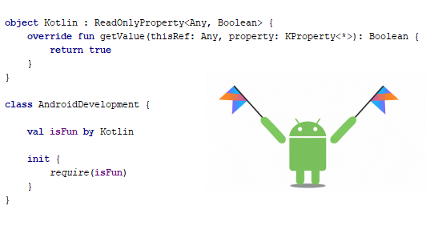

# Kotlin Delegates in Android



Kotlin truly is a beautiful language with some great features that make application development a fun and exciting experience. One of such features is [Delegated Properties](https://kotlinlang.org/docs/reference/delegated-properties.html). In this article we will see how delegates can make our life easier in Android development.

* [Basics](#basics) 
* [Fragment arguments](#fragment-arguments) 
* [SharedPreferences delegates](#sharedpreferences-delegates)
* [View delegates](#view-delegates)
* [Conclusion](#conclusion)

## Basics

First things first, what is a delegate and how does it work? Well, while it may seem like some kind of magic, it's really not that complicated.

A delegate is just a class that provides the value for a property and handles its changes. This allows us to move, or delegate, the getter-setter logic from the property itself to a separate class, letting us reuse this logic. 

Let's say we want a `String` property `param` that always has a trimmed string, i.e. with leading and trailing whitespace removed. We could do this in the property's setter like this:
```kotlin
class Example {

    var param: String = ""
        set(value) {
            field = value.trim()
        }
}
```
*If you're confused about the syntax, please refer to the [Properties](https://kotlinlang.org/docs/reference/properties.html) page in the Kotlin docs.*

Now, what if we want to reuse this functionality in some other class? Here's where delegates come in to play:
```kotlin
class TrimDelegate : ReadWriteProperty<Any?, String> {

    private var trimmedValue: String = ""

    override fun getValue(
        thisRef: Any?,
        property: KProperty<*>
    ): String {
        return trimmedValue
    }

    override fun setValue(
        thisRef: Any?,
        property: KProperty<*>, value: String
    ) {
        trimmedValue = value.trim()
    }
}
```
So a delegate is just a class with two methods: for getting and setting value of a property. To give it some more information, it is provided with the property it's working with via the instance of [`KProperty`](https://kotlinlang.org/api/latest/jvm/stdlib/kotlin.reflect/-k-property/index.html) class, and an object that has this property via `thisRef`. That's it! And here is how we can use this newly created delegate:
```kotlin
class Example {

    var param: String by TrimDelegate()
}
```
which is equivalent to this:
```kotlin
class Example {

    private val delegate = TrimDelegate()
    var param: String
        get() = delegate.getValue(this, ::param)
        set(value) {
            delegate.setValue(this, ::param, value)
        }
}
```
*`::param` is an operator that returns an instance of `KProperty` class for the property.*

As you can see, there is nothing mysterious about delegates. But despite their simplicity, they can be very useful. So let's look at some examples, specific to Android.

*You can read more about delegates in the official [docs](https://kotlinlang.org/docs/reference/delegated-properties.html).*

## Fragment arguments

We often need to pass some parameters to a fragment. It usually looks something like this:
```kotlin
class DemoFragment : Fragment() {

    private var param1: Int? = null
    private var param2: String? = null

    override fun onCreate(savedInstanceState: Bundle?) {
        super.onCreate(savedInstanceState)
        arguments?.let { args ->
            param1 = args.getInt(Args.PARAM1)
            param2 = args.getString(Args.PARAM2)
        }
    }

    companion object {
        private object Args {
            const val PARAM1 = "param1"
            const val PARAM2 = "param2"
        }

        fun newInstance(param1: Int, param2: String): DemoFragment =
            DemoFragment().apply {
                arguments = Bundle().apply {
                    putInt(Args.PARAM1, param1)
                    putString(Args.PARAM2, param2)
                }
            }
    }
}
```

So we pass the parameters when creating a fragment via its `newInstance` static method. Inside it, we put the parameters into the fragment's arguments to retrieve them later in `onCreate`.

We can make the code a little prettier, moving argument related logic to properties' getters and setters:
```kotlin
class DemoFragment : Fragment() {

    private var param1: Int?
        get() = arguments?.getInt(Args.PARAM1)
        set(value) {
            value?.let {
                arguments?.putInt(Args.PARAM1, it)
            } ?: arguments?.remove(Args.PARAM1)
        }
    private var param2: String?
        get() = arguments?.getString(Args.PARAM2)
        set(value) {
            arguments?.putString(Args.PARAM2, value)
        }

    companion object {
        private object Args {
            const val PARAM1 = "param1"
            const val PARAM2 = "param2"
        }

        fun newInstance(param1: Int, param2: String): DemoFragment =
            DemoFragment().apply {
                this.param1 = param1
                this.param2 = param2
            }
    }
}
```

But we still have to write basically the same code for each property, which can be a chore if we have many of them. Besides, it looks a little messy with all this explicit work with arguments.

So is there a way to further beautify the code? The answer is yes! And as you may have guessed, we will use property delegates. 

First, let's make some preparations. Fragment's arguments are stored in a `Bundle` object, that has separate methods for putting different types of values. So let's make an extension function that tries to put a value of arbitrary type to the bundle, and throws an exception if the type is not supported.
```kotlin
fun <T> Bundle.put(key: String, value: T) {
    when (value) {
        is Boolean -> putBoolean(key, value)
        is String -> putString(key, value)
        is Int -> putInt(key, value)
        is Short -> putShort(key, value)
        is Long -> putLong(key, value)
        is Byte -> putByte(key, value)
        is ByteArray -> putByteArray(key, value)
        is Char -> putChar(key, value)
        is CharArray -> putCharArray(key, value)
        is CharSequence -> putCharSequence(key, value)
        is Float -> putFloat(key, value)
        is Bundle -> putBundle(key, value)
        is Parcelable -> putParcelable(key, value)
        is Serializable -> putSerializable(key, value)
        else -> throw IllegalStateException("Type of property $key is not supported")
    }
}
```

Now we are ready to create the delegate itself:
```kotlin
class FragmentArgumentDelegate<T : Any> : ReadWriteProperty<Fragment, T> {

    @Suppress("UNCHECKED_CAST")
    override fun getValue(
        thisRef: Fragment,
        property: KProperty<*>
    ): T {
        val key = property.name
        return thisRef.arguments
            ?.get(key) as? T
            ?: throw IllegalStateException("Property ${property.name} could not be read")
    }

    override fun setValue(
        thisRef: Fragment,
        property: KProperty<*>, value: T
    ) {
        val args = thisRef.arguments
            ?: Bundle().also(thisRef::setArguments)
        val key = property.name
        args.put(key, value)
    }
}
```
The delegate reads property value from the fragment arguments. And when the property value changes, the delegate retrieves fragment arguments (or creates and sets new `Bundle` as arguments if the fragment doesn't have them yet), and then writes new value to these arguments, using the `Bundle.put` extension function we created before.

`ReadWriteProperty` is a [generic](https://kotlinlang.org/docs/reference/generics.html) interface that accepts two type parameters. We set the first one as `Fragment`, making this delegate usable only for properties inside a fragment. This lets us access the fragment instance with `thisRef` and manage its arguments. 

Note that we use the name of the property as the key for the argument, so that we don't have to store the keys as constants anymore.

The second type parameter of `ReadWriteProperty` determines what kind of values the property can have. We explicitly set the type as non-nullable, and throw an exception if the value cannot be read. This allows us to have non-nullable properties in our fragment, sparing us from annoying null-checks.

But sometimes we do need a property to be nullable. So let's create another delegate that, if the argument is not found, doesn't throw an exception, but returns `null` instead:
```kotlin
class FragmentNullableArgumentDelegate<T : Any?> : ReadWriteProperty<Fragment, T?> {

    @Suppress("UNCHECKED_CAST")
    override fun getValue(
        thisRef: Fragment,
        property: KProperty<*>
    ): T? {
        val key = property.name
        return thisRef.arguments?.get(key) as? T
    }

    override fun setValue(
        thisRef: Fragment,
        property: KProperty<*>, value: T?
    ) {
        val args = thisRef.arguments
            ?: Bundle().also(thisRef::setArguments)
        val key = property.name
        value?.let { args.put(key, it) } ?: args.remove(key)
    }
}
```

Next, let's make some functions for convenience (it is not necessary, just purely for aesthetic purposes):
```kotlin
fun <T : Any> argument(): ReadWriteProperty<Fragment, T> =
    FragmentArgumentDelegate()

fun <T : Any> argumentNullable(): ReadWriteProperty<Fragment, T?> =
    FragmentNullableArgumentDelegate()
```

Finally, let's put our delegates to use:
```kotlin
class DemoFragment : Fragment() {

    private var param1: Int by argument()
    private var param2: String by argument()

    companion object {

        fun newInstance(param1: Int, param2: String): DemoFragment =
            DemoFragment().apply {
                this.param1 = param1
                this.param2 = param2
            }
    }
}
```

Looks pretty neat, doesn't it?

## SharedPreferences delegates

Quite often we need to store some values in memory to quickly retrieve them the next time the app launches. For example, we might want to store some user preferences that let users customize the app. A common way to do this is to use [SharedPreferences](https://developer.android.com/reference/android/content/SharedPreferences.html) and save key-value data in them. 

Let's say we have some class that is responsible for saving and obtaining three parameters:
```kotlin
class Settings(context: Context) {

    private val prefs: SharedPreferences = 
        PreferenceManager.getDefaultSharedPreferences(context)

    fun getParam1(): String? {
        return prefs.getString(PrefKeys.PARAM1, null)
    }

    fun saveParam1(param1: String?) {
        prefs.edit().putString(PrefKeys.PARAM1, param1).apply()
    }

    fun getParam2(): Int {
        return prefs.getInt(PrefKeys.PARAM2, 0)
    }

    fun saveParam2(param2: Int) {
        prefs.edit().putInt(PrefKeys.PARAM2, param2).apply()
    }

    fun getParam3(): String {
        return prefs.getString(PrefKeys.PARAM3, null) 
            ?: DefaulsValues.PARAM3
    }

    fun saveParam3(param3: String) {
        prefs.edit().putString(PrefKeys.PARAM2, param3).apply()
    }

    companion object {
        private object PrefKeys {
            const val PARAM1 = "param1"
            const val PARAM2 = "param2"
            const val PARAM3 = "special_key_param3"
        }

        private object DefaulsValues {
            const val PARAM3 = "defaultParam3"
        }
    }
}
```

Here we obtain default `SharedPreferences` and provide methods for getting and saving the values of our parameters. We also made `param3` different in that it uses a special preference key and has non-standard default value. 

Again, we can see that we have some code duplication here. We can move some of it into private methods, of course. But it would still leave us with rather cumbersome code. Besides, what if we want to reuse this logic in some other class? Let's see how delegates can make the code a lot cleaner.

To spice things up, let's try a slightly different approach. This time, we will utilize [Object expressions](https://kotlinlang.org/docs/reference/object-declarations.html) and create extension functions for the `SharedPreferences` class.
```kotlin
fun SharedPreferences.string(
    defaultValue: String = "",
    key: (KProperty<*>) -> String = KProperty<*>::name
): ReadWriteProperty<Any, String> =
    object : ReadWriteProperty<Any, String> {
        override fun getValue(
            thisRef: Any,
            property: KProperty<*>
        ) = getString(key(property), defaultValue)

        override fun setValue(
            thisRef: Any,
            property: KProperty<*>,
            value: String
        ) = edit().putString(key(property), value).apply()
    }
```
Here we made a SharedPreferences extension function, that returns an object of an anonymous `ReadWriteProperty` subclass for our delegate. 

The delegate reads property value as `String` from preferences, using the provided `key` function for preference key. By default, the key is a property name, so we don't have to keep and pass any constants. At the same time, we still have an option to pass a custom key, if, for instance, we are afraid to run into key collisions inside the preferences, or want to have an explicit access to the key. We can also provide default value for the property, in case it is not found in the preferences.

The delegate also takes care of storing new property value in the preferences, using the same `key` function.

To make our `Settings` example work, we need to add two more delegates for `String?` and `Int` types, that work pretty much the same:
```kotlin
fun SharedPreferences.stringNullable(
    defaultValue: String? = null,
    key: (KProperty<*>) -> String = KProperty<*>::name
): ReadWriteProperty<Any, String?> =
    object : ReadWriteProperty<Any, String?> {
        override fun getValue(
            thisRef: Any,
            property: KProperty<*>
        ) = getString(key(property), defaultValue)

        override fun setValue(
            thisRef: Any,
            property: KProperty<*>,
            value: String?
        ) = edit().putString(key(property), value).apply()
    }

fun SharedPreferences.int(
    defaultValue: Int = 0,
    key: (KProperty<*>) -> String = KProperty<*>::name
): ReadWriteProperty<Any, Int> =
    object : ReadWriteProperty<Any, Int> {
        override fun getValue(
            thisRef: Any,
            property: KProperty<*>
        ) = getInt(key(property), defaultValue)

        override fun setValue(
            thisRef: Any,
            property: KProperty<*>,
            value: Int
        ) = edit().putInt(key(property), value).apply()
    }
```

And now we can finally beautify our `Settings` class:
```kotlin
class Settings(context: Context) {

    private val prefs: SharedPreferences =
        PreferenceManager.getDefaultSharedPreferences(context)

    var param1 by prefs.stringNullable()
    var param2 by prefs.int()
    var param3 by prefs.string(
        key = { "KEY_PARAM3" },
        defaultValue = "default"
    )
}
```

Now it looks much better. And if we need a new parameter in the future, it can be added literally with a single line of code!

## View delegates

Suppose we have a custom view, that consists of three text fields - a title, a subtitle and a description - with this simple layout:
```xml
<LinearLayout xmlns:android="http://schemas.android.com/apk/res/android"
    android:layout_width="match_parent"
    android:layout_height="wrap_content"
    android:orientation="vertical">

    <TextView
        android:id="@+id/tvTitle"
        android:layout_width="match_parent"
        android:layout_height="wrap_content" />

    <TextView
        android:id="@+id/tvSubtitle"
        android:layout_width="match_parent"
        android:layout_height="wrap_content" />

    <TextView
        android:id="@+id/tvDescription"
        android:layout_width="match_parent"
        android:layout_height="wrap_content" />

</LinearLayout>
```

And we want our `CustomView` to provide methods for accessing and changing text of these fields:
```kotlin
class CustomView @JvmOverloads constructor(
    context: Context,
    attrs: AttributeSet? = null
) : FrameLayout(context, attrs) {

    var title: String
        get() = tvTitle.text.toString()
        set(value) {
            tvTitle.text = value
        }

    var subtitle: String
        get() = tvSubtitle.text.toString()
        set(value) {
            tvSubtitle.text = value
        }

    var description: String
        get() = tvDescription.text.toString()
        set(value) {
            tvDescription.text = value
        }

    init {
        inflate(context, R.layout.custom_view, this)
    }
}
```
*Here we use [View binding](https://kotlinlang.org/docs/tutorials/android-plugin.html#view-binding) from [Kotlin Android Extensions](https://kotlinlang.org/docs/tutorials/android-plugin.html) to access views inside the layout.*

It is clear that we have some code that can be easily moved to a separate entity. So let's do exactly that with the help of delegates! 

Let's write a `TextView` extension function that returns a delegate for working with its text:
```kotlin
fun TextView.text(): ReadWriteProperty<Any, String> =
    object : ReadWriteProperty<Any, String> {
        override fun getValue(
            thisRef: Any,
            property: KProperty<*>
        ): String = text.toString()

        override fun setValue(
            thisRef: Any,
            property: KProperty<*>, value: String
        ) {
            text = value
        }
    }
```
And now use it in our `CustomView`:
```kotlin
class CustomView @JvmOverloads constructor(
    context: Context,
    attrs: AttributeSet? = null
) : FrameLayout(context, attrs) {

    var title by tvTitle.text()
    var subtitle by tvSubtitle.text()
    var description by tvDescription.text()

    init {
        inflate(context, R.layout.custom_view, this)
    }
}
```
It may not seem like a crazy improvement over the original code, but the point is to demonstrate the power of delegates. Besides, they are so fun to write!

Of course, you are not limited to `TextView`. For example, here is a delegate for view visibility (`keepBounds` determines whether the view should still take up space in layout or not when it's not visible):
```kotlin
fun View.isVisible(keepBounds: Boolean = false): ReadWriteProperty<Any, Boolean> =
    object : ReadWriteProperty<Any, Boolean> {
        override fun getValue(
            thisRef: Any,
            property: KProperty<*>
        ): Boolean = visibility == View.VISIBLE

        override fun setValue(
            thisRef: Any,
            property: KProperty<*>,
            value: Boolean
        ) {
            visibility = when {
                value -> View.VISIBLE
                keepBounds -> View.INVISIBLE
                else -> View.GONE
            }
        }
    }
```

Here's a delegate for progress in a `ProgressBar` as a float number from 0 to 1:
```kotlin
fun ProgressBar.progress(): ReadWriteProperty<Any, Float> =
    object : ReadWriteProperty<Any, Float> {
        override fun getValue(
            thisRef: Any,
            property: KProperty<*>
        ): Float = if (max == 0) 0f else progress / max.toFloat()

        override fun setValue(
            thisRef: Any,
            property: KProperty<*>, value: Float
        ) {
            progress = (value * max).toInt()
        }
    }
```
And this is how we could use them if we had a `progressBar` in our `CustomView`:
```kotlin
class CustomView @JvmOverloads constructor(
    context: Context,
    attrs: AttributeSet? = null
) : FrameLayout(context, attrs) {

    var title by tvTitle.text()
    var subtitle by tvSubtitle.text()
    var description by tvDescription.text()

    var progress by progressBar.progress()
    var isProgressVisible by progressBar.isVisible()

    init {
        inflate(context, R.layout.custom_view, this)
    }
}
```

As you can see, you can delegate whatever you want - really, the sky is the limit!

## Conclusion

We have looked at some examples of Kotlin property delegates in Android development. Of course, you can think of many other ways to utilize them in your application. The goal was to demonstrate what a powerful tool property delegation is, and what can be achieved with it. And, hopefully, now you're sold on the idea of using delegates yourself!


*Author: Dmitry Akishin akishindev@gmail.com at Finch, 2019*
