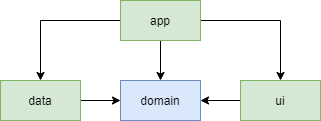

# Logging in Android

Logging is a useful and often necessary step in developing an Android application. It allows us to log errors, debug messages and other useful information. No doubt, every developer utilizes it one way or another - be it printing messages in console, or setting up an elaborate logging system. 

Although logging may seem like a trivial task, it still can impose several challenges, especially in a multi-module project. In this post we will look at how we can easily set up logging in the app.

## Defining the task

First, let's define the task at hand. Suppose we have a multi-module Kotlin project with this basic structure:

 - _app_ module is the main module of the app - it knows about other modules, sets up DI and makes other project-level configuring. Here lies our `Application` class.
 - _domain_ module contains business logic of the app - domain entities, interactors and repository interfaces. As it does not really need to know anything about Android or other modules, we want to keep it a pure Java module (hence the blue color on the diagram)
 - _data_ module has repository implementations. It's responsible for retrieving and mapping data via network, storing data in a database etc.
  - _ui_ module contains presentation logic of the app - activities, fragments etc.
  
 Now, we want to achieve logging that:
  - has concise syntax;
  - is available in every module;
  - can be controlled in one place;
  - let us keep full control.
 
 Next, let's look at possible solutions.
 
 ## Considering options
 
 
