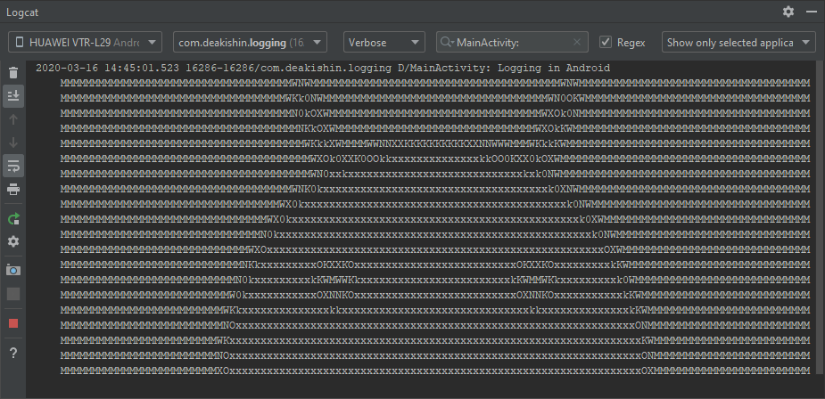
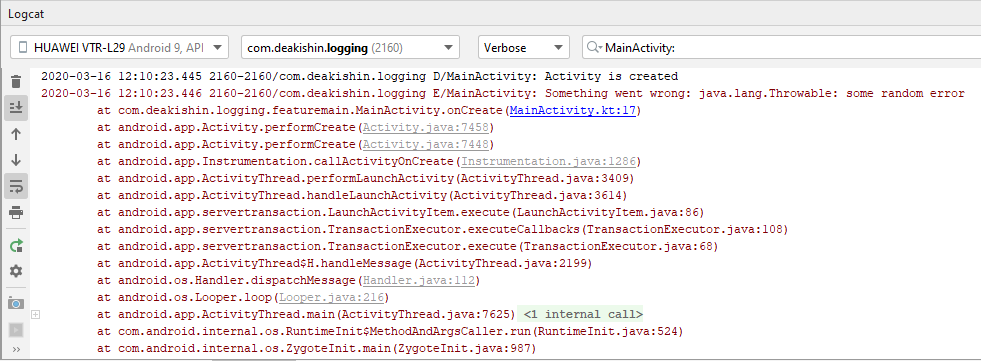

# Logging in a multi-module Android project



No doubt, every delevoper is familiar with the concept of logging. We can log errors, debug messages and other useful information we might need during development. 

And although logging in Android is pretty easy and straightforward, it still can impose some challenges in a multi-module project. In this post we will look at one way to solve these problems.

_Note: we will use Kotlin, but it still can be easily adapted for a Java project._

## The problem

Suppose we have a multi-module project. Among our modules we have a _domain_ module that contains business logic of the app - domain entities and interactors. And as this module doesn't really need to know anything about Android, we made it a pure Kotlin module (i.e. without any Android dependencies).

So, we need a logging mechanism that can be accessed in every module (including _domain_).
Let's see what options we have:

1) The first thing that comes to mind is, of course, the Android [Log](https://developer.android.com/reference/android/util/Log) class. It is a standard Android way of writing logs, that can be then [viewed in logcat](https://developer.android.com/studio/debug/am-logcat). It has a concise syntax and support for different log levels (error, debug, info, etc.), which is a good thing. The problem here though is that it is a part of an Android library, so we can't use it in our _domain_ module (and other pure Kotlin modules we might have).

2) We might also look at Kotlin's [println](https://kotlinlang.org/api/latest/jvm/stdlib/kotlin.io/println.html) function. With this we can very easily print logs into logcat, and the messages will appear under the tag "System.out". But while we can use this method from anywhere in the app, it doesn't provide different log levels. Moreover, we might probably want to organize logging in one place, rather that having it scattered throughout the app.

3) The next thing we might try is using one of the third-party libraries, most notably [Timber](https://github.com/JakeWharton/timber). But while such library could alleviate all of our problems, it would mean that we had to add the dependency to it in every module of our app, including our _domain_, and we would want to avoid that, especially for something as trivial as logging.

4) Finally, probably the cleanest way would be to set up a logging interface in _domain_, implement it somewhere else (for example in the _app_ module), and provide it via [dependency injection](https://developer.android.com/training/dependency-injection). But that would mean we have to inject it in every class we need logging in, which is far from convenient and seems like an overkill.

So it looks like all the options are not quite what we need...

## Logger to the rescue!

Luckily, there is already a perfect solution out of the box in the form of [java.util.logging.Logger](https://developer.android.com/reference/java/util/logging/Logger). And all we have to do is use it! So let's look at how to do this in Android.

The process is quite simple - we obtain a logger object via the static `Logger.getLogger()` function, and use it to log messages with various `log` methods (that allow us to specify a log level, a message and an optional `Throwable` exception). Then these messages are forwarded to the registered [handlers](https://developer.android.com/reference/java/util/logging/Handler), which are free to handle the messages however they like. 

Basically, there is a ready-to-use logging interface in place, and our job is just to provide its implementation. And an important thing is that `Logger` is a part of a standard Java library, meaning we can use it in non-Android modules - which is exactly what we want.

Android actually provides a [default logging handler](https://github.com/aosp-mirror/platform_frameworks_base/blob/master/core/java/com/android/internal/logging/AndroidHandler.java). But to gain full control over what is being logged and how, let's write our own implementation. You can place it in any Android module visible by the main _app_ module, or in the _app_ module itself.

```kotlin
class AndroidLoggingHandler : Handler() {

    override fun isLoggable(record: LogRecord?): Boolean =
      super.isLoggable(record) && BuildConfig.DEBUG

    override fun close() {
        // ignore
    }

    override fun flush() {
        // ignore
    }

    override fun publish(record: LogRecord) {
        val tag = record.loggerName
        val level = getAndroidLevel(record.level)
        val message = record.thrown?.let { thrown ->
            "${record.message}: ${Log.getStackTraceString(thrown)}"
        } ?: record.message

        try {
            Log.println(level, tag, message)
        } catch (e: RuntimeException) {
            Log.e(this.javaClass.simpleName, "Error logging message", e)
        }
    }

    private fun getAndroidLevel(level: Level): Int =
        when (level.intValue()) {
            Level.SEVERE.intValue() -> Log.ERROR
            Level.WARNING.intValue() -> Log.WARN
            Level.INFO.intValue() -> Log.INFO
            Level.FINE.intValue() -> Log.DEBUG
            else -> Log.DEBUG
        }
}
```

In `isLoggable()` we can control what messages we want to log and when. Here we use the default implementation (via a call to `super.isLoggable()`) and also add an additional condition - we want to enable logging only for debug builds.

The `close()` and `flush()` methods are ignored as we don't need them.

Finally, we implement the `publish()` function that actually does the logging. We use the beforementioned Android [Log](https://developer.android.com/reference/android/util/Log) class and its `println()` method, that expects a tag, a log level and a message. For the tag we take the name of the logger. The log level is obtained from the `getAndroidLevel()` function, where we map [Logger.Level](https://developer.android.com/reference/java/util/logging/Level) to a level defined in the [Log](https://developer.android.com/reference/android/util/Log) class. And the message is composed from the log message and a stack trace string of the exception, if present. We also wrap `println()` in a try-catch block, just in case something goes wrong.

Next, let's add a static function that sets up the handler:
```kotlin
class AndroidLoggingHandler : Handler() {

   // ...
   
   companion object {
        fun setup() {
            val rootLogger = LogManager.getLogManager().getLogger("")
            for (handler in rootLogger.handlers) {
                rootLogger.removeHandler(handler)
            }
            rootLogger.addHandler(AndroidLoggingHandler())
            rootLogger.level = Level.FINE
        }
    }
}
```
We remove all handlers from the root logger and add our own implementation. We also specify [Level.FINE](https://developer.android.com/reference/java/util/logging/Level#FINE) as the minimum level for messages we want to log.

Now that we have our `Handler` ready, we can set it up in our [Application](https://developer.android.com/reference/android/app/Application) class:

```kotlin
class App : Application() {

    override fun onCreate() {
        super.onCreate()
        // ...
        
        AndroidLoggingHandler.setup()
    }
}
```

That's it! We can now use `Logger` from anywhere in the app:

```kotlin
class MainActivity : Activity(){

    override fun onPause() {
        super.onPause()
        Logger.getLogger("MainActivity").log(Level.FINE, "Activity is paused")
        Logger.getLogger("MainActivity")
            .log(Level.SEVERE, "Something went wrong", Throwable("some random error"))
    }
}
```

...and the messages will be visible in [logcat](https://developer.android.com/studio/debug/am-logcat):


 
However, the syntax is still not very concise and contains some boilerplate. So let's utilize [Kotlin extensions](https://kotlinlang.org/docs/reference/extensions.html) (we can place them in the _domain_ module):

```kotlin
fun Any.logD(message: String) {
    logger.log(Level.FINE, message)
}

fun Any.logE(message: String) {
    logger.log(Level.SEVERE, message)
}

fun Any.logE(message: String, throwable: Throwable) {
    logger.log(Level.SEVERE, message, throwable)
}

private val Any.logger: Logger
    get() = Logger.getLogger(this::class.java.simpleName)
```

And now it is much more convenient and pretty:
```kotlin
class MainActivity : AppCompatActivity() {

    override fun onCreate(savedInstanceState: Bundle?) {
        super.onCreate(savedInstanceState)
        setContentView(R.layout.activity_main)

        logD("Activity is created")
        logE("Something went wrong", Throwable("some random error"))
    }
}
```

Here we have it! With a single class and a couple of extension functions we set up a logging system that works in a milti-module project, has a concise syntax, is easy to configure and customize, and that we have total control over.

## Extra profit

In addition, there is maybe an unexpected, but nevertheless a rather pleasant advantage in our approach. 

Some libraries use [java.util.logging.Logger](https://developer.android.com/reference/java/util/logging/Logger) for logging (e.g. [Socket.IO Client Library for Java](https://github.com/socketio/socket.io-client-java)). And our setup allows us to view and control logs from these libraries with no extra work! Moreover, these logs might not be loggable by the default Android handler - for example, Socket.IO library logs messages with the [Level.FINE](https://developer.android.com/reference/java/util/logging/Level#FINE) level, which are ignored by default. But with our own implementation, we can see the logs just fine.

This also means that we can use [Logger](https://developer.android.com/reference/java/util/logging/Logger) in our own libraries that we want to reuse across different projects. This way we can integrate logs from these libraries into an existing logging system of each concrete project.

## Conclusion

There are different options we have when it comes to logging in Android. In this post we looked at one approach you can take to easily set up logging in a multi-module project. Hopefully, you are now convinced to adopt it in your own projects!

_Author: Dmitry Akishin akishindev@gmail.com at Finch, 2020_
